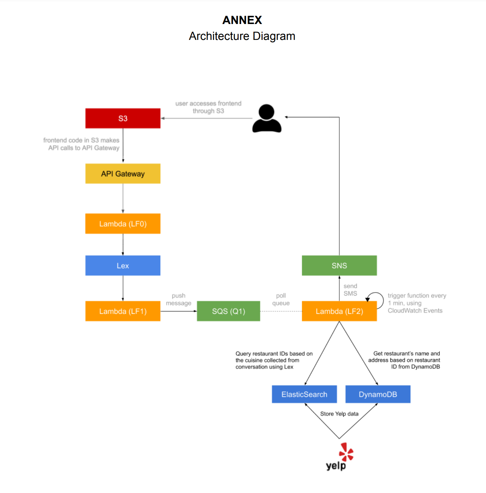

# Dining Concierge Chatbot
A web application that sends user restaurant recommendations given a set of preferences that they provide the chatbot.

### Example Interaction :

User: Hello

Bot: Hi there, how can I help?

User: I need some restaurant suggestions.

Bot: Great. I can help you with that. What city or city area are you looking to dine in?

User: Manhattan

Bot: Got it, Manhattan. What cuisine would you like to try?

User: Japanese

Bot: Ok, how many people are in your party?

User: Two

Bot: A few more to go. What date?

User: Today

Bot: What time?

User: 7 pm, please

Bot: Great. Lastly, I need your phone number so I can send you my findings.

User: 123-456-7890

Bot: You’re all set. Expect my suggestions shortly! Have a good day.

User: Thank you!

Bot: You’re welcome.

(a few minutes later)

User gets the following text message:

“Hello! Here are my Japanese restaurant suggestions for 2 people, for today at 7 pm: 1.

Sushi Nakazawa, located at 23 Commerce St, 2. Jin Ramen, located at 3183 Broadway,

3. Nikko, located at 1280 Amsterdam Ave. Enjoy your meal!”

### Workflow :

1. User input the message
2. Step 1 triggers the lambda function that send this message to lex bot.
3. Lex chatbot use the lambda function for catching intent and validate parameters.
4. When it got all the required information (Cuisine type, Reservation time and data, Number of party, Phone Number),
it would send these information to SQS.
5. SQS triggers the lambda function which check the best fit restaurants via ElasticSearch and get the full information of restaurant via DynamoDB. Then, it sends these information to user's phone via SNS service.

### Architecture Image :

